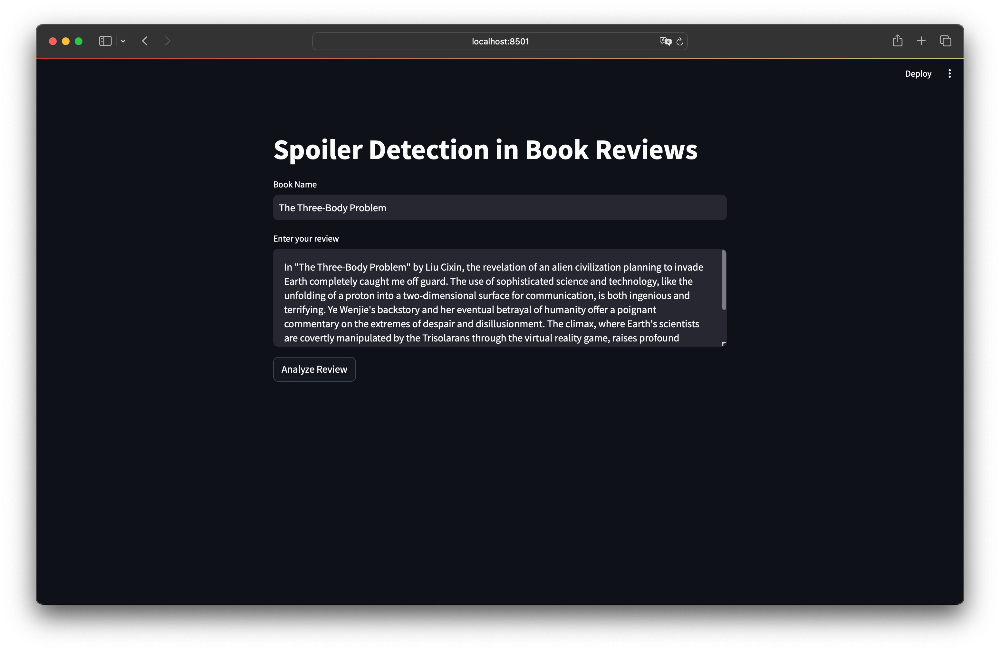
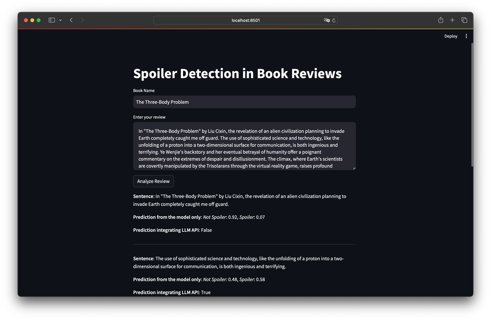
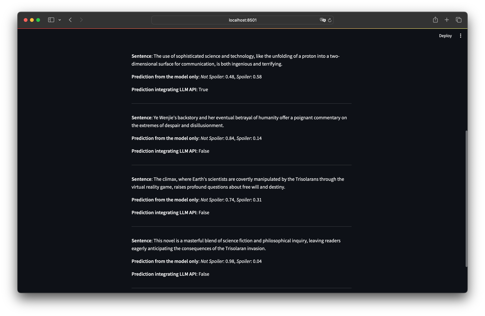

# CSCI-GA 2565 Final Project: Implementing SpoilerNet

## Description

SpoilerNet is a machine learning project aimed at identifying spoilers in book reviews using a custom model based on contextual data. This project utilizes OpenAI's API and is deployable via Streamlit. Our model aims to help users avoid spoilers in reviews on platforms like Goodreads.

## Project Structure

```
SpoilerNet/
├── README.md
├── data
│   ├── README.md
│   ├── processed
│   │   ├── README.md
│   │   └── review_context_final.json.gz
│   └── raw
│       ├── README.md
│       └── goodreads_reviews_spoiler.json.gz
├── images
│   ├── 1.png
│   ├── 2.png
│   └── 3.png
├── index.py
├── models
│   ├── README.md
│   ├── complete_model.pth
│   └── model_state_dict.pth
├── notebooks
│   ├── data_preprocessing.ipynb
│   ├── model_implementation.ipynb
│   └── spoilernet.py
└── static
    ├── cc.es.300.bin
    ├── embedding_matrix.pth
    ├── index_to_word.pkl
    └── word_to_index.pkl
```

## Setup

### Requirements

- Python 3.8+
- Streamlit
- OpenAI API access

### Installation

Clone the repository:

```bash
git clone https://github.com/yourgithubusername/spoilernet.git
cd spoilernet
```

### Data Preparation

Refer to the README under the `data/` directory for instructions on downloading and preparing the necessary datasets.

### Embedding Generation

To generate the word embeddings for the SpoilerNet model, run the embedding generation code block in the `notebooks/model_implementation.ipynb` notebook. This will generate the necessary files in the `static/` directory. Since the size of the embedding file is too large to be uploaded to GitHub, I did not include it in the repository. You may download it following this Google drive link: [embedding_matrix.pth](https://drive.google.com/file/d/1NRp7pmJW6r1hOwmwd28eyDGKhx6cMdne/view?usp=sharing) (NYU email required).

### Trained Model

The training process for the SpoilerNet model is detailed in the `notebooks/model_implementation.ipynb` notebook. The trained model file should be included in the `models/` directory. If you would like to train the model yourself, refer to the notebook for instructions. However, due to the size of the trained model file, I did not include it in the repository. You may download it following this Google drive link: [complete_model.pth](https://drive.google.com/file/d/1j9bsl7ZXRF2jSm5WCzunO8MiNsk64pyj/view?usp=sharing) (NYU email required).

### Running the Application

After putting the necessary files in place, you can run the SpoilerNet application using Streamlit.

To deploy the SpoilerNet model using Streamlit:

```bash
streamlit run index.py
```

Note that API keys and other sensitive information should be stored in a `.env` file.

## Demo







## Usage

Once the Streamlit application is running, navigate to the local web server address provided in your terminal to interact with the SpoilerNet system.
